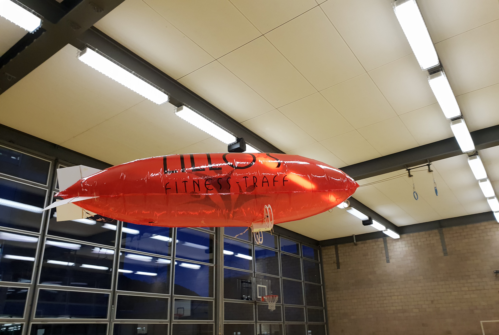

# Abstract: Blimp
Ziel unseres Projektes war ein ferngesteuertes Prallluftschiff zu bauen.
Wir experimentierten mit unterschiedlichen Materialien und Verfahren, um eine möglichst gasdichte Hülle zu fabrizieren. Die Hülle dient als Grundgerüst, an dem die Ruder und Gondel samt Motoren und Sensoren befestigt werden. Durch einen leichten Überdruck erhält die Hülle Stabilität und ihre Form, welche durch einen Kompromiss zwischen einem kleinem Oberflächen-zu-Volumen-Verhältnis und Aerodynamik entstand. Des Weiteren überlegten wir uns verschiedene Steuerungsmechanismen mit deren Vor- und Nachteile.
Eine grosse Herausforderung bestand darin, das Gewicht des Luftschiffes zu reduzieren. Denn ein geringeres Gewicht erlaubt uns die Hülle kleiner zu dimensionieren und somit an teurem Traggas zu sparen.
Als zentrale Steuerungseinheit am Luftschiff fungiert ein Raspberry Pi Zero W. Er empfängt über WLAN die Steuersignale, verarbeitet diese und betätigt die Motoren und Servos. Ausserdem liest er die in der Gondel befestigten Sensoren aus. Das Luftschiff ist mit zwei Kameras, einem GPS, einem Beschleunigungssensor, einem Gyroskop, einem Barometer, einem Kompass, einem Analogdigitalwandler für die Batteriespannung und zwei Ultraschall-Distanzsensoren ausgestattet. Um die vorher genannten Aufgaben zu erfüllen, schrieben wir ein Programm in C++. Anhand der Sensordaten liesse sich die Lage und Orientierung des Zeppelins berechnen und somit ein Autopilot programmieren. Als Fernsteuerung dient ein Java Programm, das zusätzlich die Sensordaten und die Videostreams anzeigt. Als Traggas entschieden wir uns Helium, statt Wasserstoff zu verwenden, damit wir auch innerhalb von Gebäuden fliegen dürfen. Da Helium relativ teuer ist, suchten wir nach einem Sponsor. «Lillo’s Fitness-Träff» willigte ein und stellte uns das Helium zur Verfügung. 
Unser Luftschiff wiegt samt Hülle leicht über 450 g, ist rund 2.40 m lang und hat einen Durchmesser von 60 cm. Dank dem geringen Gewicht dürfen wir rechtlich über Menschenansammlungen fliegen. Zudem kann das Luftschiff im Vergleich zu einer Drohne länger in der Luft bleiben.

